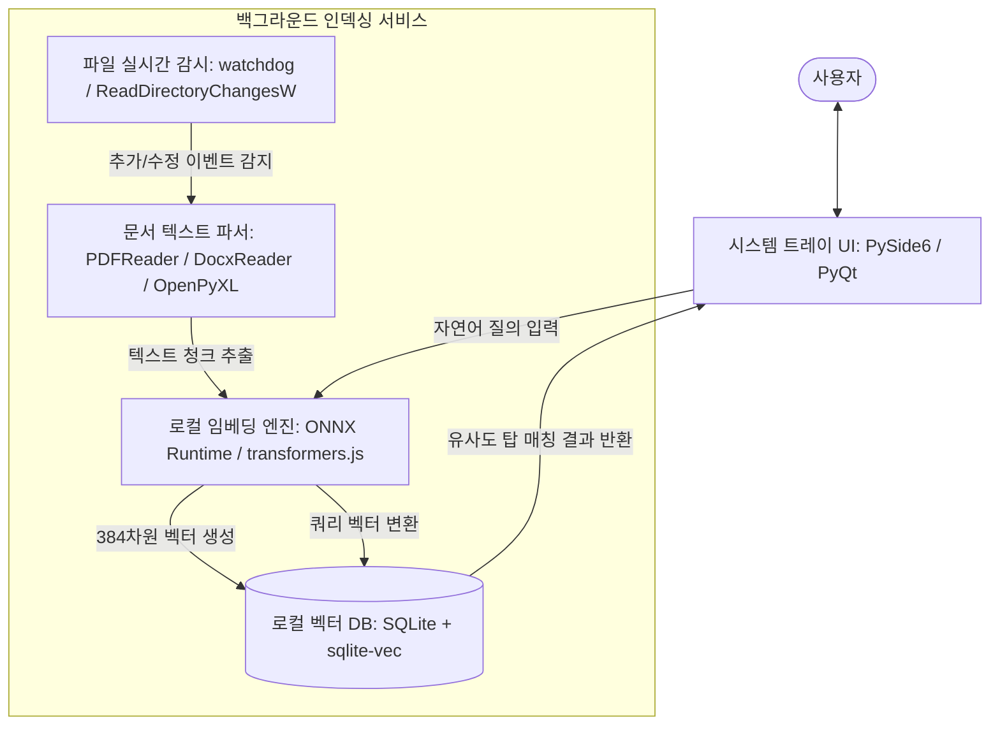

# 시스템 설계 문서: Windows용 로컬 의미론적 파일 검색기 (ContextFinder)

본 문서는 사용자의 파일명 기억 한계를 보완하기 위해 100% 오프라인 온디바이스(On-Device) AI 기술을 활용하여 파일의 세부 내용까지 맥락 검색(Semantic Search)할 수 있는 Windows 데스크톱 유틸리티 **ContextFinder**의 시스템 아키텍처 및 설계 명세서입니다.

---

## 1. 프로젝트 개요 및 아키텍처 목표

- **100% 프라이버시 보호 (Zero-Cloud)**: 문서 내용을 외부 API나 클라우드 서버로 일절 전송하지 않고 모든 AI 임베딩 연산과 데이터베이스 저장을 사용자 PC 로컬 내에서 완수합니다.
- **초경량 백그라운드 운용 (Low-Resource)**: 일반 사무용 PC의 CPU 환경에서도 가볍게 동작하며, 백그라운드 색인 중 시스템 자원 점유율을 최소화합니다.
- **Windows 시스템 친화성**: 시스템 트레이(System Tray)에 상주하며, 단축키(`Win + Alt + F` 등) 클릭 시 즉각적인 자연어 쿼리 팝업 창을 렌더링합니다.
- **메타데이터 하이브리드 검색**: 의미론적 유사성(Vector Cosine Similarity)과 파일 메타데이터(파일 형식, 수정일 범위) 필터링을 결합한 하이브리드 검색을 제공합니다.

---

## 2. 시스템 아키텍처 (System Architecture)

ContextFinder는 **실시간 파일 감시 모듈**, **텍스트 전처리 및 임베딩 파이프라인**, **로컬 벡터 DB**, **시스템 트레이 사용자 인터페이스**로 나뉩니다.



---

## 3. 핵심 모듈 설계 명세

### 3.1 실시간 파일 변경 감시 모듈 (File Monitor)
- **역할**: 사용자가 지정한 로컬 디렉토리(예: `C:\Users\username\Documents`, `Downloads` 등)의 파일 생성, 수정, 삭제 이벤트를 실시간 모니터링합니다.
- **Windows API 연동**: Python `watchdog` 라이브러리를 사용하며, 내부적으로 Windows의 `ReadDirectoryChangesW` API를 비동기식으로 호출하여 최소한의 CPU 오버헤드로 이벤트 감지.
- **안전 장치 (Debounce)**: 대용량 파일 저장이나 잦은 수정 시 발생하는 중복 트리거를 방지하기 위해 파일 쓰기가 완전히 끝난 후 1초간 대기했다가 색인을 트리거(Debouncing)하는 큐(Queue) 구조 채택.

### 3.2 문서 텍스트 파서 및 청크 분할기 (Text Extractor & Chunker)
- **파서 팩토리**: 파일 확장자별 라이브러리를 연동하여 비정형 데이터를 일반 텍스트로 추출합니다.
  - `.txt`, `.md`: 기본 UTF-8 디코딩
  - `.pdf`: `pypdf` 또는 `pdfplumber`
  - `.docx`: `python-docx`
  - `.xlsx`: `openpyxl`
- **텍스트 청크 분할 (Chunking)**: 임베딩 모델의 최대 토큰 입력 한계(예: 512 토큰) 및 매칭 정확도를 고려하여 텍스트를 일정 크기로 분할합니다.
  - **정책**: 500자 단위 분할, 50자 오버랩(Overlap) 적용 (문맥 끊김 방지)

### 3.3 로컬 임베딩 엔진 (Local Embedding Engine)
- **모델 선정**: `all-MiniLM-L6-v2`
  - **크기**: 90MB 내외의 ONNX 포맷 모델 채택
  - **특징**: 384차원의 의미론적 밀집 벡터(Dense Vector) 생성. 뛰어난 영문 및 기초 다국어 지원 성능. 한국어 의미 강화를 원할 경우 `ko-sbert` 계열의 경량 모델(약 120MB)로 유연하게 교체 가능하도록 추상화 계층 설계.
- **실행 모듈**: `onnxruntime` (C++ 백엔드 기반으로 구동되어 별도의 대형 PyTorch 프레임워크 설치 없이 신속하게 연산 수행).

### 3.4 로컬 벡터 데이터베이스 (Embedded Vector DB)
- **기술**: **SQLite (sqlite-vec 확장 모듈 활성화)**
  - **선정 이유**: 디스크 기반 단일 파일 데이터베이스로 설치가 불필요하며, C 기반의 `sqlite-vec` 라이브러리를 통해 벡터 유사도 연산(L2 Distance, Cosine Similarity)을 인덱스 수준에서 고속 수행 가능.
- **스키마**:
  - `documents`: 파일 자체의 메타데이터 저장
  - `document_chunks`: 분할된 텍스트 및 의미 벡터 데이터 저장 (상호 외래키 참조)

---

## 4. 데이터베이스 스키마 설계 (Database Schema)

```sql
-- 1. 문서 메타데이터 테이블
CREATE TABLE documents (
    id TEXT PRIMARY KEY,               -- 파일 절대 경로의 해시값 (SHA-256)
    file_path TEXT NOT NULL,           -- 파일 절대 경로
    file_name TEXT NOT NULL,           -- 파일명
    file_extension TEXT NOT NULL,      -- 파일 확장자
    file_size INTEGER NOT NULL,        -- 파일 크기 (Bytes)
    last_modified TIMESTAMP NOT NULL,  -- 최종 수정 시간
    indexed_at TIMESTAMP DEFAULT CURRENT_TIMESTAMP
);

-- 2. 분할된 텍스트 청크 및 벡터 매핑 테이블 (sqlite-vec 구조)
CREATE TABLE document_chunks (
    id TEXT PRIMARY KEY,
    document_id TEXT NOT NULL,         -- 외래키 (documents.id)
    chunk_index INTEGER NOT NULL,      -- 청크 순서 (0, 1, 2...)
    text_content TEXT NOT NULL,        -- 실제 텍스트 조각
    FOREIGN KEY(document_id) REFERENCES documents(id) ON DELETE CASCADE
);

-- 3. 벡터 데이터 테이블 (sqlite-vec 전용 가상 테이블)
-- 384차원의 실수 벡터 데이터 저장 공간
CREATE VIRTUAL TABLE chunk_embeddings USING vec0(
    chunk_id TEXT PRIMARY KEY,
    embedding float[384]               -- 384차원 실수 벡터 정의
);
```

---

## 5. 핵심 데이터 흐름 (Data Flow)

### 5.1 파일 실시간 인덱싱 시퀀스
```
[파일 탐색기] ➔ (수정 완료) ➔ [FileWatcher] 
                              │ (경로 송신)
                              ▼
                       [Parser Factory] ➔ 텍스트 추출 및 청크 분할
                                           │ (청크 데이터 전달)
                                           ▼
                                    [Embedding Engine] ➔ ONNX 모델 연산 (384차원)
                                                          │ (임베딩 실수값 반환)
                                                          ▼
                                                   [SQLite Vector DB] ➔ DB 적재
```

### 5.2 자연어 의미론적 검색 시퀀스
```
[사용자 검색어 입력] ➔ "지난주에 작성했던 마케팅 계획서 리포트"
                            │
                            ▼
                    [Embedding Engine] ➔ 검색어의 384차원 벡터 추출
                            │
                            ▼
                    [SQLite Vector DB] ➔ vec_distance_cosine() 함수로 코사인 유사도 연산
                                       ➔ 메타데이터 조건 추가 (last_modified BETWEEN ...)
                            │
                            ▼ (유사도 순 탑 5 리스트 반환)
                    [TrayUI 결과창 렌더링] ➔ 더블클릭 시 Windows 기본 프로그램으로 파일 즉시 오픈
```

---

## 6. 상세 기술 스택 및 라이브러리 구성

| 구분 | 기술 스택 | 상세 스택 및 목적 |
| :--- | :--- | :--- |
| **UI Framework** | **PySide6 (PyQt6)** | 크로스플랫폼 지원, 시스템 트레이 네이티브 연동, 가벼운 메모리 점유 |
| **Watcher** | **watchdog (Python)** | OS 네이티브 파일 이벤트를 안정적으로 구독하는 백그라운드 서비스 구현 |
| **ONNX Runtime** | **onnxruntime (Python)** | CPU 기반 로컬 기계학습 모델 추론 속도 극대화 및 경량 패키징 |
| **DB Engine** | **SQLite3 + sqlite-vec** | 로컬 경량 데이터베이스 내 인라인 벡터 유사도 검색 |
| **App Packaging** | **PyInstaller** | 사용자가 파이썬 설치 없이 실물이 포함된 단일 `.exe` 실행 파일로 구동할 수 있도록 가상 런타임 패키징 |

---

## 7. Windows 시스템 트레이 및 단축키 연동 상세 (System Integration)

- **백그라운드 상주**: 앱을 실행하면 바탕화면에 작업 창이 나타나지 않고, Windows 우측 하단 알림 영역(System Tray)에 ContextFinder 돋보기 아이콘이 활성화됩니다.
- **글로벌 핫키 등록**: Windows API의 `RegisterHotKey`를 바인딩하여, 사용자가 어느 화면에 있든 `Win + Alt + F`를 클릭하면 화면 정중앙에 투명 블러 효과(Acrylic Effect)가 적용된 맥락 검색 인터페이스 팝업을 즉시 오픈합니다.
- **파일 더블클릭 액션**: 검색 결과 리스트에서 파일을 더블클릭하면 Windows OS 내부 `os.startfile(filepath)` API를 호출하여 사용자가 평소 사용하던 기본 문서 편집기(Acrobat Reader, MS Word, Notepad++ 등)로 즉각 파일을 실행해 줍니다.

---

> [!WARNING]
> **초기 대용량 색인(Initial Indexing) 처리 지침**
> 최초 실행 시 지정한 폴더 내의 수천 개 문서를 한 번에 색인할 때 CPU 점유율이 일시적으로 급증할 수 있습니다. 이를 예방하기 위해 초기 색인은 백그라운드 스레드(Worker Thread)에서 순차적으로(Queueing) 실행되도록 제어해야 하며, 컴퓨터 사용이 없는 유휴 시간(System Idle)에 가동률을 높이고 사용자가 활발히 마우스를 움직일 때는 색인 속도를 늦추는 쓰로틀링(Throttling) 정책을 필수로 적용해야 합니다.
