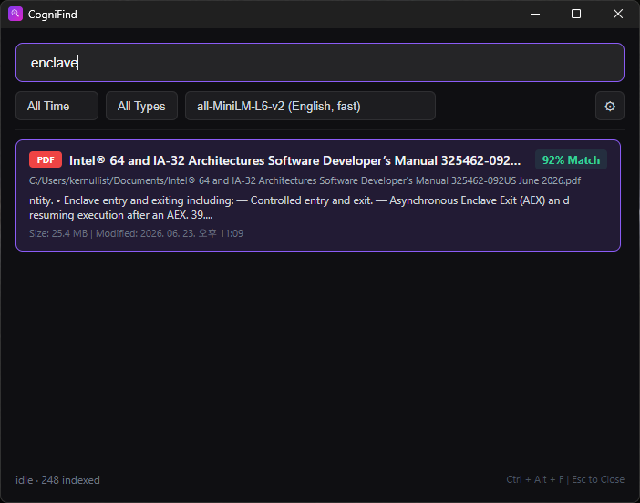

# CogniFind

<p align="center">
  
</p>

CogniFind is a 100% offline, on-device local semantic document search utility for Windows. It runs in the system tray, monitors designated directories in real-time, and allows you to instantly search through file contents using natural language queries via a Spotlight-style popup window.

---

## Features

- **Zero-Cloud Privacy**: All vector embeddings and SQLite databases are calculated and stored locally on your machine.
- **Low-Resource Background Indexing**: Automatically monitors system idle state using the Windows API. When active user input (mouse/keyboard) is detected, background indexing throttles its CPU usage to keep the operating system highly responsive.
- **Real-Time Watchdog**: Automatically detects file additions, modifications, renames, and deletions. Uses a debounced event queue to prevent redundant indexing during active file saves.
- **Spotlight-Style Search Window**: A dark-themed, resizable search window that is toggled via a global system hotkey (Ctrl + Alt + F) or by clicking the tray icon.
- **Supported Formats**: Parses and indexes Text/Markdown (.txt, .md), PDF (.pdf), Word (.docx), and Excel (.xlsx) files. Scanned/image PDFs (no text layer) are detected and logged; an optional OCR fallback can recover their text (see below).
- **Hybrid Metadata Filtering**: Combines semantic vector similarity search with file metadata filters (file type, date range).
- **Modern UI**: Built with Tauri + React + TypeScript for a fast, responsive user experience.

---

## Prerequisites

### For Development

- **Operating System**: Windows 10/11
- **Python**: Version 3.10 or higher (Tested on 3.12.2)
- **Node.js**: Version 18 or higher (Tested on 24.14.1)
- **Rust**: Version 1.77 or higher (Tested on 1.96.0)

### For Production Use

- **Operating System**: Windows 10/11
- No additional dependencies required (all bundled in installer)

---

## Installation

### Production Build (Recommended)

Download and run the installer from the releases page:

- `CogniFind_0.1.0_x64-setup.exe` (NSIS installer)
- `CogniFind_0.1.0_x64_en-US.msi` (MSI installer)

### Development Setup

1. **Install Python dependencies**:

```bash
pip install PySide6 watchdog pypdf python-docx openpyxl onnxruntime sqlite-vec huggingface_hub numpy fastapi uvicorn pyinstaller pymupdf rapidocr-onnxruntime
```

2. **Install Tauri CLI**:

```bash
npm install -g @tauri-apps/cli@latest
```

3. **Install frontend dependencies**:

```bash
cd frontend
npm install
```

---

## How it Works

1. **Pre-heating**: On startup, the Python backend loads the local embedding engine in a background thread (so the UI stays responsive and can show a download progress bar). It resolves model files in this order: the per-user cache (`~/.cognifind/models/`), then the models shipped next to the executable (`models/` in the portable folder, offline), and only then a download from the Hugging Face Hub if downloads are enabled. Production builds ship the models and run fully offline by default.
2. **Directory Scanning**: Scans watched directories (configured in SQLite/settings or the in-app settings panel, defaulting to your Documents, Desktop, Downloads, and OneDrive folders). Build artifacts and dependency dirs (node_modules, .git, build, dist, target, etc.) are skipped. It deletes records of removed files and queues new or modified files.
3. **Chunking & Embeddings**: Extracts text from documents, splits it into 500-character chunks with a 50-character overlap, converts them into 384-dimensional normalized vectors via ONNX Runtime, and saves them in the local database (~/.cognifind/contextfinder.db).
4. **Vector Searching**: When you type a query, it is embedded into a vector, and a K-Nearest Neighbors (KNN) search is executed on the sqlite-vec virtual table using cosine distance.

---

## Architecture

CogniFind uses a **dual-process architecture**:

```
┌─────────────────────────────────┐
│   Tauri Frontend (Rust + React) │
│  - Frameless transparent window │
│  - Global hotkey (Ctrl+Alt+F)  │
│  - System tray icon             │
│  - Python process management    │
└──────────────┬──────────────────┘
               │ HTTP (localhost:8765)
               ▼
┌─────────────────────────────────┐
│   Python Backend (FastAPI)      │
│  - ONNX embedding engine        │
│  - SQLite + sqlite-vec          │
│  - watchdog file monitoring     │
│  - Text parsing & chunking      │
└─────────────────────────────────┘
```

The Tauri frontend handles UI rendering and system integration, while the Python backend performs all AI/ML operations and database management.

---

## Project Structure

```
CogniFind/
├── api.py                          # FastAPI backend server (localhost:8765)
├── build.ps1                       # Production build script
├── dev.ps1                         # Development mode script
├── cognifind-backend.spec          # PyInstaller configuration
├── src/                            # Python modules
│   ├── config.py                   # Global constants and paths
│   ├── database.py                 # SQLite + sqlite-vec operations
│   ├── embedding.py                # ONNX model inference
│   ├── parser.py                   # Document text extraction
│   └── watcher.py                  # File system monitoring
├── frontend/                       # Tauri application
│   ├── src/
│   │   ├── App.tsx                 # React UI components
│   │   ├── App.css                 # Dark theme styles
│   │   ├── api.ts                  # Python API client
│   │   └── types.ts                # TypeScript type definitions
│   ├── src-tauri/
│   │   ├── src/lib.rs              # Rust: process management, hotkey, tray
│   │   ├── Cargo.toml              # Rust dependencies
│   │   └── tauri.conf.json         # Tauri configuration
│   └── package.json                # Node.js dependencies
├── release.ps1                     # Release packaging script (version bump + zip)
└── LICENSE                         # AGPL-3.0
```

---

## Usage

### Production

1. **Download and extract** the portable zip from the GitHub Releases page.
2. **Run `CogniFind.exe`** from the extracted folder.
3. A magnifying glass icon will appear in your Windows system tray, and the background thread will begin scanning your watched directories.

### Development

```bash
# Option 1: Use the dev script
.\dev.ps1

# Option 2: Manual start
cd frontend
npx tauri dev
```

### Using the Search

1. **Trigger the Search Bar**: Press **Ctrl + Alt + F** from anywhere on your system to toggle the borderless search pop-up.

2. **Navigate & Open**: Type your natural language query. Results update in real-time. Use the **Up/Down Arrow Keys** to highlight a result; **single-click** selects, and **double-click** opens the document with its default Windows application. (Enter does not open a file, to avoid launching the wrong/stale top result by accident.) Press **Escape** or click outside the window to dismiss the search bar.

3. **Filter Results**: Use the dropdown filters to narrow results by date range (Today, This Week, This Month) or file type (PDF, DOCX, XLSX, TXT, MD).

---

## Building from Source

Run the full build pipeline:

```powershell
.\build.ps1
```

This script will:

1. Build the Python backend with PyInstaller (~90MB)
2. Copy the backend executable to Tauri's binaries directory
3. Install frontend dependencies
4. Compile the Tauri application
5. Assemble a **portable package** at `dist/CogniFind-portable/` (plus a `.zip`):
   `CogniFind.exe`, `cognifind-backend.exe`, and a `models/` folder fetched by
   `scripts/fetch_models.py`

### Portable distribution & updates

The portable folder runs fully offline — no model download at runtime. The
shipped backend has downloads disabled by default (`ALLOW_MODEL_DOWNLOAD=False`);
set `COGNIFIND_ALLOW_DOWNLOAD=1` to re-enable on-demand downloads.

```
CogniFind/
├── CogniFind.exe            # replace on update
├── cognifind-backend.exe    # replace on update
└── models/                  # persists across updates (minilm, e5-multilingual)
```

**To update**, replace only the two `.exe` files; the large `models/` folder
stays in place, so updates are small. (WebView2 Runtime is required on the
target machine — preinstalled on current Windows 10/11.)

Output files will be in `frontend/src-tauri/target/release/bundle/`.

---

## OCR for scanned PDFs

PDFs without a text layer (scanned/image PDFs) yield no text from normal
extraction. CogniFind detects these and falls back to OCR: it renders each page
with PyMuPDF and recognizes text with `rapidocr-onnxruntime` (ONNX-based, fully
offline — no external engine). OCR is **bundled in the build** (it adds ~80MB
and is slow, a few seconds per page, but runs only on PDFs with no text layer).

For development, install the OCR libraries so OCR runs under `dev.ps1`:

```bash
pip install pymupdf rapidocr-onnxruntime
```

If these are not installed, OCR is skipped gracefully (scanned PDFs are detected
and logged, just not searchable). Find files that failed extraction with:

```bash
python scripts/inspect_index.py     # flags documents with 0 chunks
```

> Note: enabling OCR does not retroactively re-index PDFs that were already
> recorded as empty (their content hash is unchanged, so they are skipped).
> Delete those documents (or modify the files) to force a re-index with OCR.

---

## Configuration

### Monitored Directories

By default, CogniFind monitors:

- `C:\Users\<username>\Documents`
- `C:\git\CogniFind\test_watch` (development only)

You can modify monitored directories through the settings API:

```bash
curl -X PUT http://localhost:8765/api/settings \
  -H "Content-Type: application/json" \
  -d '{"monitored_dirs": ["C:/Users/username/Documents", "D:/Projects"]}'
```

### Database Location

All data is stored in `~/.cognifind/`:

- `contextfinder.db` - SQLite database with documents and embeddings
- `models/` - ONNX model files (downloaded on first run)

---

## API Reference

The Python backend exposes a REST API on `http://localhost:8765`:

| Endpoint | Method | Description |
|----------|--------|-------------|
| `/api/search` | POST | Semantic search with filters |
| `/api/status` | GET | Get indexing status |
| `/api/settings` | GET | Get monitored directories |
| `/api/settings` | PUT | Update monitored directories |
| `/api/model` | GET | Get active and available embedding models |
| `/api/model` | PUT | Switch embedding model (clears index and re-indexes) |
| `/api/index/scan` | POST | Trigger manual rescan |
| `/api/open-file` | POST | Open file with default application |

### Search Request Example

```json
{
  "query": "marketing report from last week",
  "date_from": "2024-01-01T00:00:00",
  "date_to": null,
  "extensions": [".pdf", ".docx"],
  "limit": 5
}
```

---

## License

CogniFind is licensed under the **GNU Affero General Public License v3.0 (AGPL-3.0)**. See [LICENSE](LICENSE) for the full text.

In short: you are free to use, study, modify, and redistribute it, but if you distribute the software or run a modified version as a network service, you must make the corresponding source code available under the same license.

```
Copyright (C) 2026 kernullist

This program is free software: you can redistribute it and/or modify it under
the terms of the GNU Affero General Public License as published by the Free
Software Foundation, either version 3 of the License, or (at your option) any
later version. This program is distributed WITHOUT ANY WARRANTY; without even
the implied warranty of MERCHANTABILITY or FITNESS FOR A PARTICULAR PURPOSE.
See the GNU Affero General Public License for more details.
```

### Third-party components

CogniFind bundles and builds on the following, each under its own license:

- **PyMuPDF** (PDF text extraction / OCR rendering) — AGPL-3.0; the project's AGPL license follows from this dependency.
- **PySide6** — LGPL-3.0.
- **ONNX Runtime**, **python-docx**, **openpyxl**, **sqlite-vec** — MIT.
- **tokenizers**, **huggingface_hub**, **rapidocr-onnxruntime**, **Tauri**, **React** — Apache-2.0 / MIT.
- Embedding models: **sentence-transformers/all-MiniLM-L6-v2** (Apache-2.0) and **intfloat/multilingual-e5-small** via Xenova (MIT).
